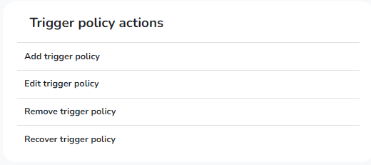

# Metagov Gateway / PolicyKit Sandbox

Consider the platforms you use for online communities today. These platforms only offer governance options that are top-down, autocratic, and punitive, involving admins and mods. But what if platforms could provide other types of governance, such as more democratic ones? What if communities could <i>build for themselves</i> the governance that suits their needs and values?  

The Metagov Gateway / PolicyKit Sandbox is a platform-specific governance-authoring application built with [PolicyKit](https://policykit.org/) that leverages [Metagov Gateway's](https://gateway.metagov.org/) open-source API gateway.

The sandbox gives online communities the ability to connect the platforms where their communities live with the tools and platforms where decision making happens. Policies authored with PolicyKit are extended by Metagov Gateway, making it is possible to connect the platform-specific policies to other applications where decision making takes place, such as Loomio, SourceCred, and Open Collective. The gateway provides this extension through a standardized plugin architecture that facilitates connections between a community's platform-specific policies and these external applications.

The sandbox currently supports governance authoring on Slack, Reddit, and Discourse and requires communities to write custom-code policies for each base platform. See the [PolicKit documentation](https://policykit.readthedocs.io/en/latest/writing_policies.html) for more information on how to write a policy, and the Metagov [Gateway documentation](https://docs.metagov.org/en/latest/driver_tutorial.html) on how to extend those policies using the Gateway plugins. Discord support is in development.

## Types of Platform Actions Authored by PolicyKit 

### Constitution Policy Actions

### Platform Policy Actions

### Trigger Policy Actions

### Community Documents Actions

### Role Actions

## Learn More

Visit the [PolicyKit GitHub](https://github.com/policykit/policykit) and [docs](https://policykit.readthedocs.io/en/latest/index.html), and the [Metagov Gateway GitHub](https://github.com/metagov/gateway) and [docs](https://docs.metagov.org/en/latest/) for more information on each respective piece of software driving this sandbox.

You can also learn more about PolicyKit and its origins in Elinor Ostrom's framework of commons governance in the PolicyKit team's ACM UIST 2020 [paper](https://policykit.org/static/policyengine/pdf/policykit_uist2020.pdf) and [video](https://vimeo.com/446531759).
